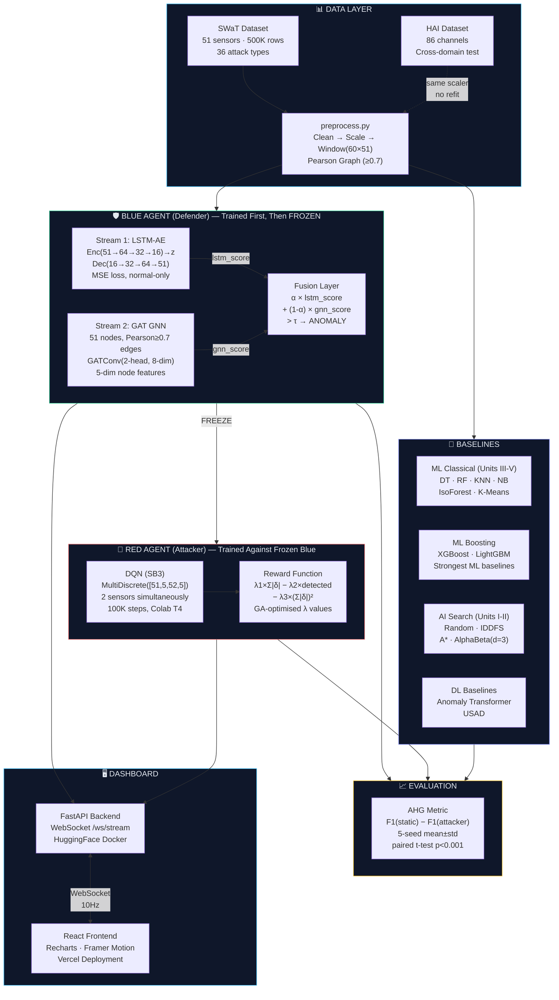
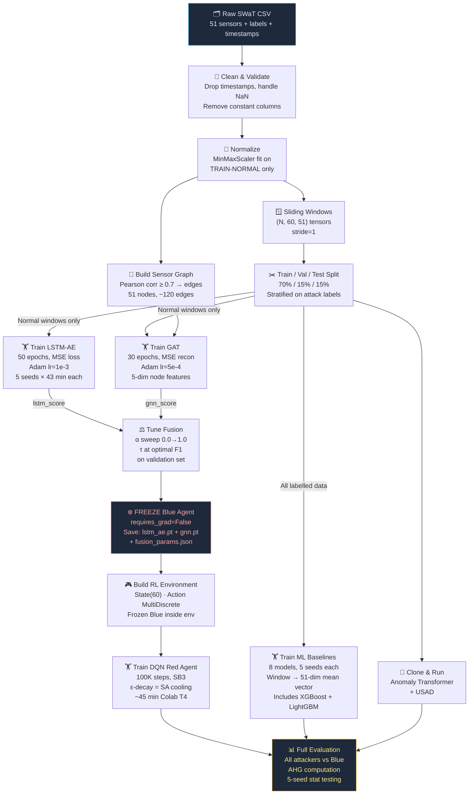
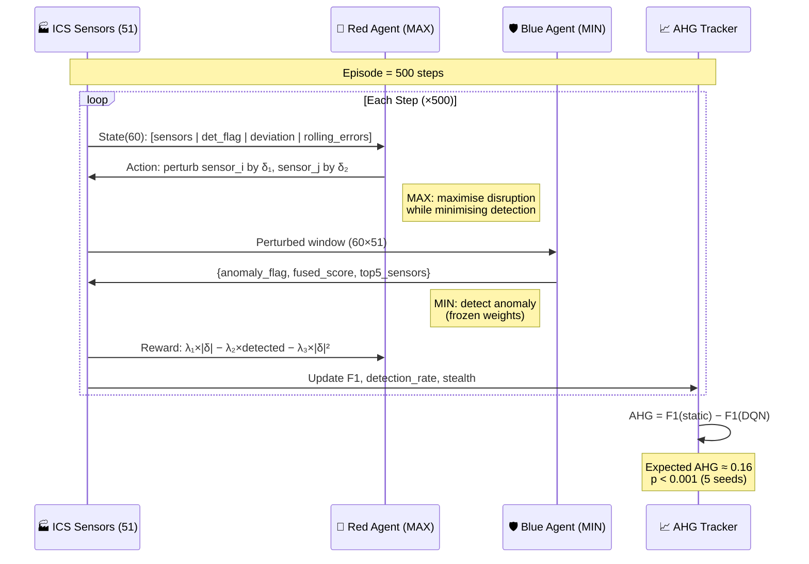
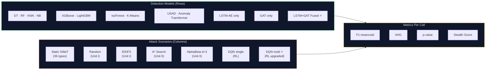
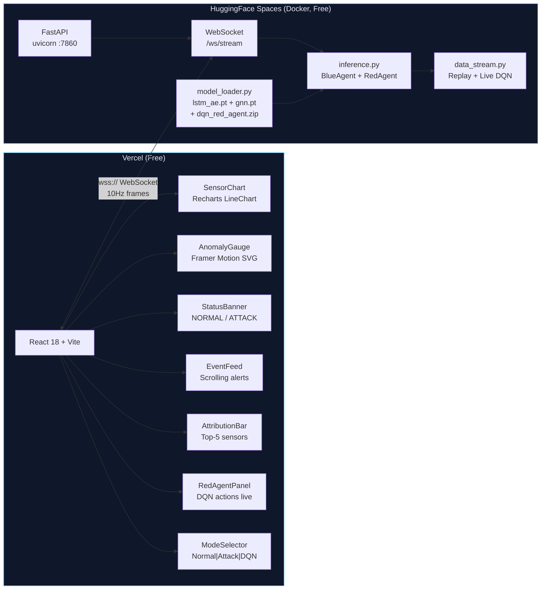
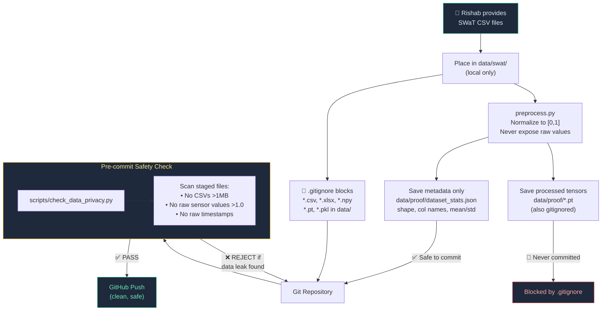
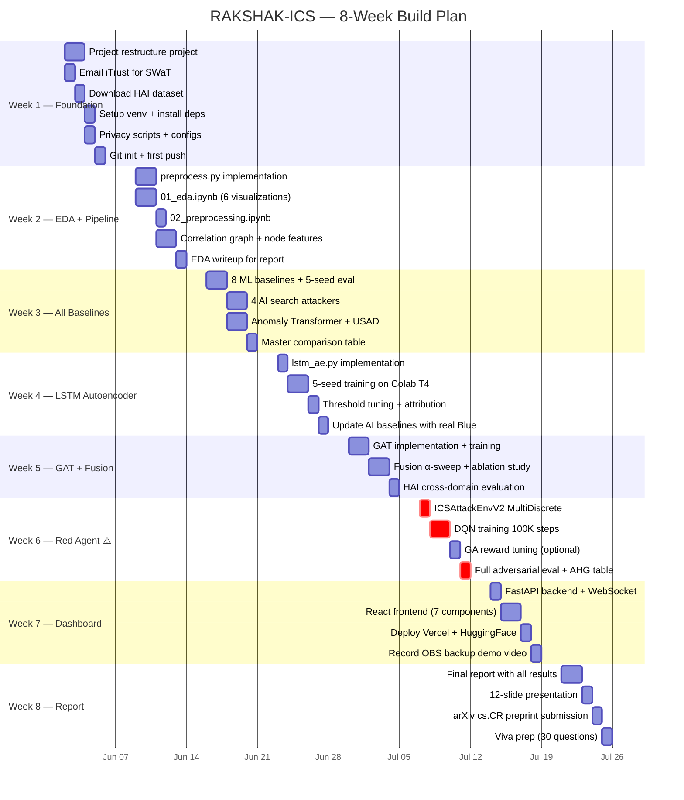
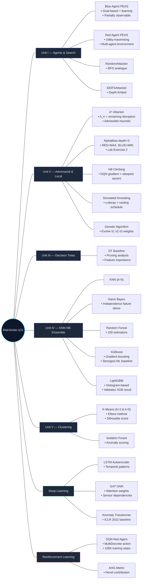

# RAKSHAK-ICS — System Design & Timeline

> Master blueprint — review and approve before any code is written.

---

## 1. High-Level System Architecture



---

## 2. Data Flow & Training Pipeline

The order matters — each stage feeds the next. Blue must be frozen before Red trains.



---

## 3. Adversarial Game — Red vs Blue

This is the core research contribution. The game alternates MAX (Red) and MIN (Blue) moves.



---

## 4. Evaluation Matrix

Every model is evaluated against every attacker — this table IS the paper's central result.



### Expected Results Table

> All results as mean±std across 5 seeds. XGBoost/LightGBM are the strongest ML baselines — the gap between them and LSTM+GAT Fused is the key argument for DL.

| Model | Type | Expected F1 | AUC-ROC | AIML Unit |
|---|---|---|---|---|
| Decision Tree | Supervised ML | 0.71±0.012 | 0.83 | Unit III |
| Random Forest | Ensemble ML | 0.71±0.010 | 0.87 | Unit IV |
| KNN (k=5) | Supervised ML | 0.65±0.015 | 0.79 | Unit IV |
| Naive Bayes | Supervised ML | 0.63±0.009 | 0.71 | Unit IV |
| **XGBoost** | **Gradient Boosting** | **0.76±0.011** | **0.89** | **Unit IV** |
| **LightGBM** | **Gradient Boosting** | **0.77±0.010** | **0.90** | **Unit IV** |
| Isolation Forest | Unsupervised | 0.67±0.011 | 0.77 | Unit V |
| K-Means (k=2) | Clustering | 0.57±0.018 | N/A | Unit V |
| USAD | DL Baseline | 0.85±0.013 | 0.91 | DL comparison |
| Anomaly Transformer | DL Baseline | 0.91±0.009 | 0.96 | DL comparison |
| LSTM-AE only | Your DL | 0.90±0.011 | 0.97 | Ablation A |
| GAT only | Your DL | 0.89±0.013 | 0.94 | Ablation B |
| **LSTM+GAT Fused** | **Your contribution** | **0.93±0.009** | **0.98** | **Primary result** |

> *"Even LightGBM — the strongest classical ML baseline at F1=0.77 — falls 16% short of our LSTM+GAT fusion (F1=0.93), demonstrating that handcrafted feature aggregation cannot capture temporal-structural patterns."*

---

## 5. Dashboard Architecture



---

## 6. Dataset Privacy & Safety Workflow



---

## 7. File Structure

```
rakshak-ics/
├── configs/
│ └── default.yaml # All hyperparameters
├── data/
│ ├── swat/.gitkeep # 🔒 Raw CSVs here (gitignored)
│ ├── hai/.gitkeep # 🔒 HAI CSVs here (gitignored)
│ └── proof/.gitkeep # 🔒 Processed tensors (gitignored)
│ # dataset_stats.json ✅ (safe)
├── external/ # Cloned baseline repos
│ ├── anomaly-transformer/ # thuml/Anomaly-Transformer
│ └── usad/ # (gitignored or submoduled)
├── notebooks/ # Sequential pipeline
│ ├── 01_eda.ipynb
│ ├── 02_preprocessing.ipynb
│ ├── 03_ml_baselines.ipynb ← DT, RF, KNN, NB, IsoForest, K-Means, XGBoost, LightGBM
│ ├── 03b_ai_baselines.ipynb ← Random, IDDFS, A*, AlphaBeta
│ ├── 03c_dl_baselines.ipynb ← Anomaly Transformer, USAD
│ ├── 04_lstm_autoencoder.ipynb
│ ├── 05_gat.ipynb ← GAT (not GraphSAGE)
│ ├── 05b_ablation.ipynb
│ ├── 06_fusion_eval.ipynb
│ ├── 07_rl_red_agent.ipynb
│ ├── 07b_ga_reward_tuning.ipynb
│ └── 08_adversarial_eval.ipynb
├── src/
│ ├── __init__.py
│ ├── preprocess.py # Data pipeline
│ ├── baselines.py # 8 ML models (incl. XGBoost, LightGBM)
│ ├── ai_search.py # 4 AI attackers + GA
│ ├── dl_baselines.py # Anomaly Transformer + USAD wrappers
│ ├── lstm_ae.py # LSTM Autoencoder
│ ├── gnn.py # GAT (upgraded from GraphSAGE)
│ ├── fusion.py # α-weighted fusion + ablation
│ ├── rl_env.py # Gymnasium env, MultiDiscrete
│ ├── rl_train.py # DQN training (SB3)
│ ├── evaluate.py # Unified eval + AHG
│ └── stat_utils.py # 5-seed wrapper + t-tests
├── scripts/
│ └── check_data_privacy.py # Pre-commit NDA checker
├── dashboard/
│ ├── backend/ # FastAPI + WebSocket
│ │ ├── main.py
│ │ ├── model_loader.py
│ │ ├── inference.py
│ │ ├── data_stream.py
│ │ ├── requirements.txt
│ │ └── Dockerfile
│ └── frontend/ # React + Vite
│ ├── src/
│ │ ├── App.jsx
│ │ ├── components/ (7 files)
│ │ └── hooks/useSensorStream.js
│ ├── package.json
│ └── vite.config.js
├── models/ # 🔒 Saved weights (gitignored)
├── results/
│ ├── figures/
│ ├── tables/
│ └── logs/ # 🔒 Training logs (gitignored)
├── report/ # Final project report
├── plans/ # Claude guides + blueprints
├── .gitignore
├── requirements.txt
├── LICENSE
└── README.md
```

---

## 8. Eight-Week Timeline



---

## 9. AIML Curriculum Coverage Map

Every AIML unit explicitly maps to a RAKSHAK-ICS component:



---

## 10. Key Research Contributions (What Makes This Publishable)

| # | Claim | Evidence | Status |
|---|---|---|---|
| 1 | First LSTM+GAT dual-stream fusion for ICS anomaly detection | PCGAT has GAT but no LSTM. STA-GNN has attention but no LSTM-AE fusion. | ✅ Novel |
| 2 | First DQN Red Agent on SWaT water treatment SCADA | No found paper. NREL 2024 is energy DER, not water. | ✅ Novel |
| 3 | First formal AHG metric definition and quantification | Stojanovic 2021 shows degradation exists but never formalises it. | ✅ Novel |
| 4 | First adversarial ICS paper with Indian policy context | No Indian institutional adversarial ICS paper found. CERT-In 2025 mandates timing. | ✅ Novel |
| ~~5~~ | ~~SOTA F1 on SWaT~~ | PCGAT 2025 claims SOTA. Our 0.93 is competitive, not definitively #1. | ❌ Do NOT claim |

---

> [!IMPORTANT]
> **Ready when you are.** All diagrams above are the blueprint. No code has been touched. When you say "start", I'll begin executing Week 1 tasks and will handle your datasets with full NDA safety.
